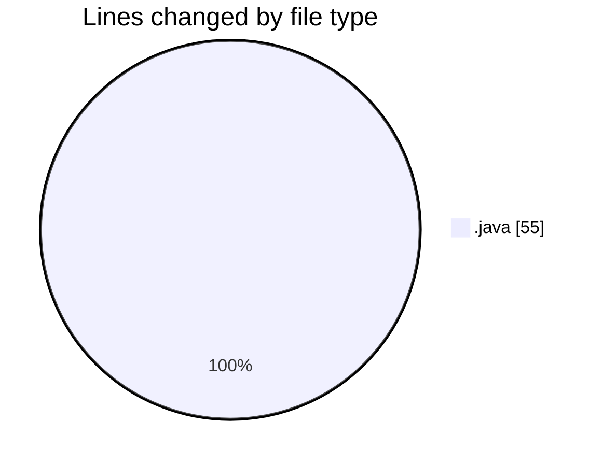
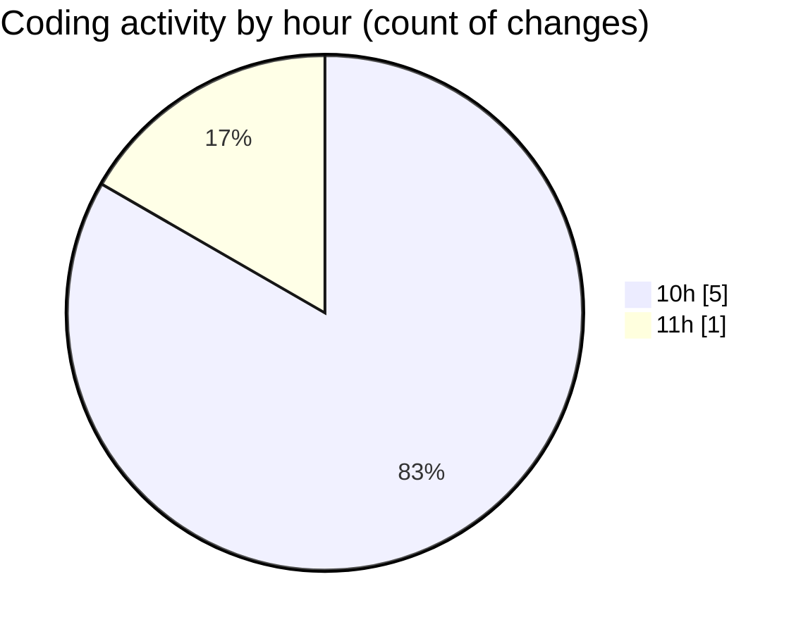

# java - Activity Summary 

## Overall Statistics

| Stat                   | Value                                                             |
| ---------------------- | ----------------------------------------------------------------- |
| **Lines Added** (➕)   | 55                                          |
| **Lines Removed** (➖) | 0                                        |
| **Net Change** (↕)    | 55                |
| **Active Time** (⌚)   | 4 minutes |

## Modified Files
- **RockPaperScissors.java** (+9, -0)
- **Main.java** (+4, -0)
- **Calculatorframe.java** (+4, -0)
- **CalculatorGui.java** (+38, -0)

## Visualizations

### By File Type (Lines Changed)

### By Hour (Estimated Activity Count)

> **Last Updated:** 1/29/2025, 11:28:18 AM