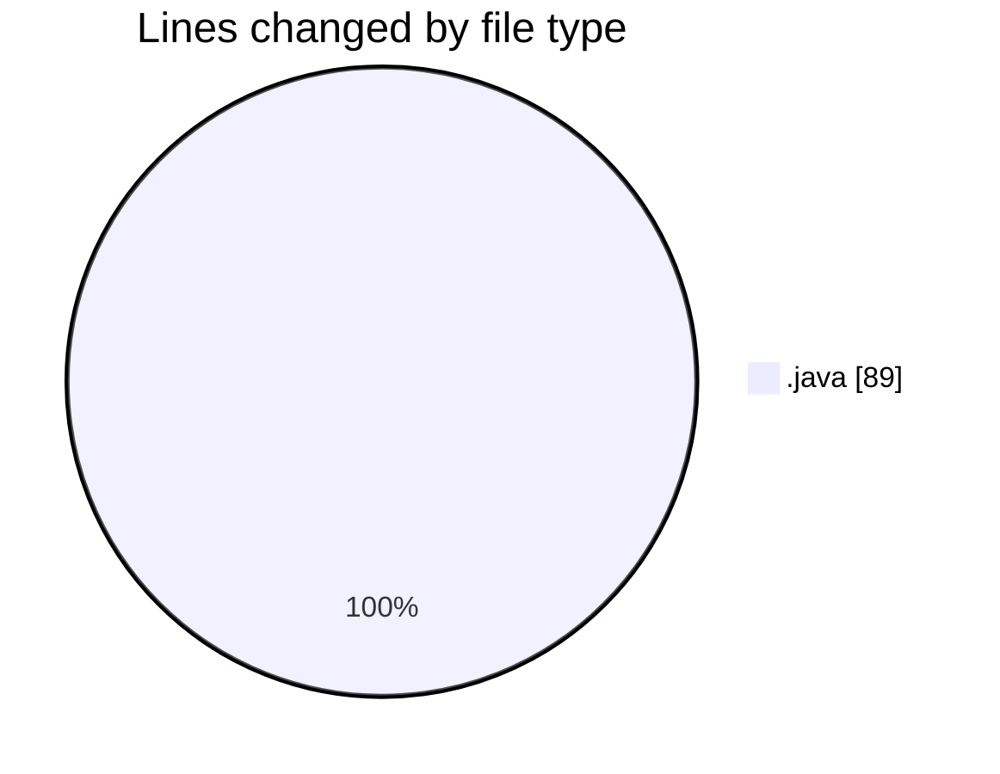

# coding prac - Activity Summary 

## Overall Statistics

| Stat                   | Value                                                             |
| ---------------------- | ----------------------------------------------------------------- |
| **Lines Added** (➕)   | 89                                          |
| **Lines Removed** (➖) | 0                                        |
| **Net Change** (↕)    | 89                |
| **Active Time** (⌚)   | 17 minutes |

## Modified Files
- **TestAverage.java** (+28, -0)
- **timebasic.java** (+20, -0)
- **Main.java** (+24, -0)
- **public class fahrenheit {.java** (+4, -0)
- **bmi.java** (+13, -0)

## Visualizations

### By File Type (Lines Changed)

### By Hour (Estimated Activity Count)

> **Last Updated:** 2/5/2025, 4:43:08 PM