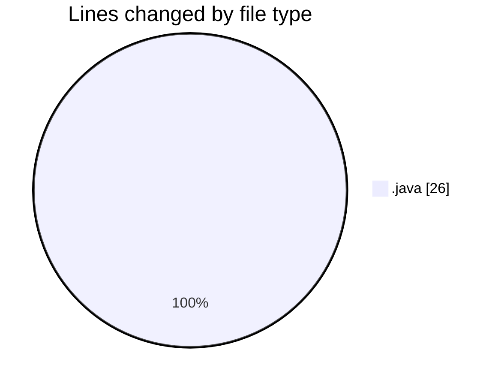
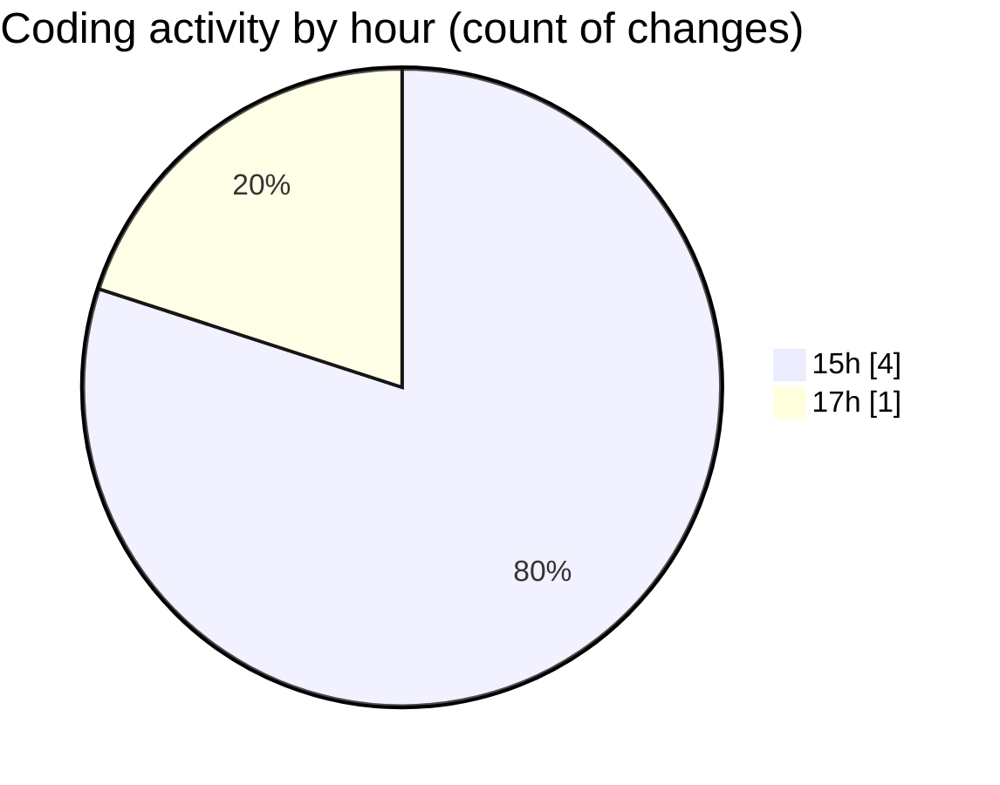

# coding prac 2 - Activity Summary 

## Overall Statistics

| Stat                   | Value                                                             |
| ---------------------- | ----------------------------------------------------------------- |
| **Lines Added** (➕)   | 26                                          |
| **Lines Removed** (➖) | 0                                        |
| **Net Change** (↕)    | 26                |
| **Active Time** (⌚)   | 3 minutes |

## Modified Files
- **CommonDigitCheck.java** (+18, -0)
- **Main.java** (+4, -0)
- **SpeedingTicket.java** (+4, -0)

## Visualizations

### By File Type (Lines Changed)

### By Hour (Estimated Activity Count)

> **Last Updated:** 2/7/2025, 5:15:45 PM