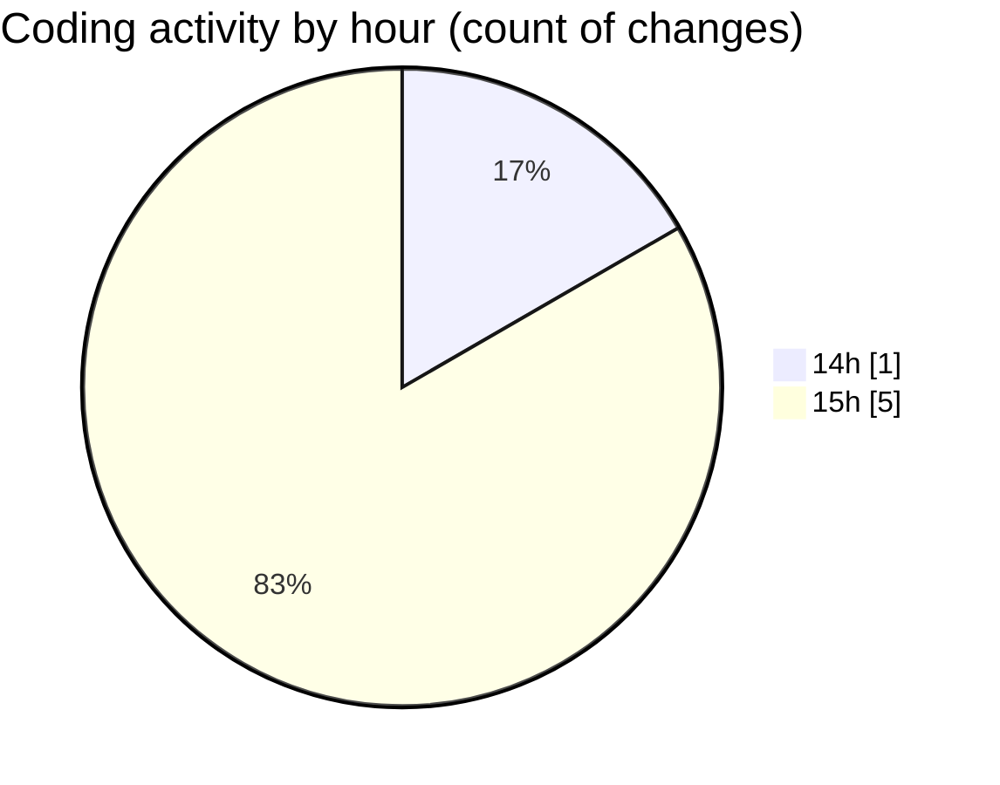

# optional codings - Activity Summary 

## Overall Statistics

| Stat                   | Value                                                             |
| ---------------------- | ----------------------------------------------------------------- |
| **Lines Added** (➕)   | 53                                          |
| **Lines Removed** (➖) | 0                                        |
| **Net Change** (↕)    | 53                |
| **Active Time** (⌚)   | 5 minutes |

## Modified Files
- **Shippingoptional.java** (+41, -0)
- **BillOptionl.java** (+12, -0)

## Visualizations

### By File Type (Lines Changed)

### By Hour (Estimated Activity Count)

> **Last Updated:** 2/8/2025, 3:32:01 PM