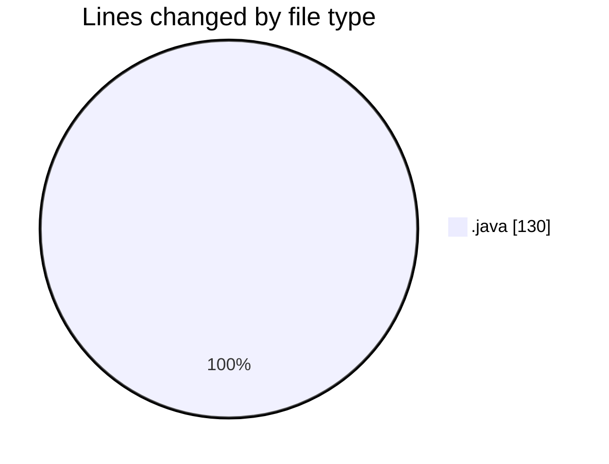
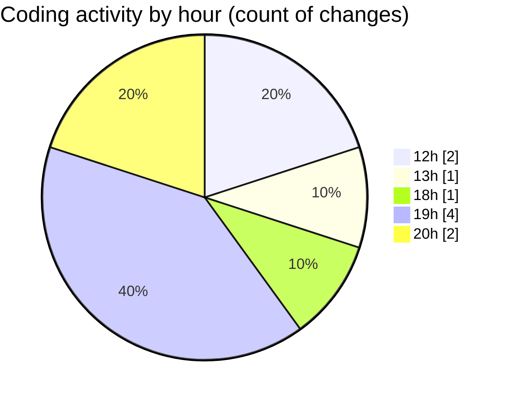

# classwork - Activity Summary 

## Overall Statistics

| Stat                   | Value                                                             |
| ---------------------- | ----------------------------------------------------------------- |
| **Lines Added** (➕)   | 125                                          |
| **Lines Removed** (➖) | 5                                        |
| **Net Change** (↕)    | 120                |
| **Active Time** (⌚)   | 10 minutes |

## Modified Files
- **Main.java** (+19, -0)
- **wow.java** (+14, -0)
- **sentinalStructure.java** (+27, -5)
- **CheckingInput.java** (+27, -0)
- **MaxMin.java** (+38, -0)

## Visualizations

### By File Type (Lines Changed)

### By Hour (Estimated Activity Count)

> **Last Updated:** 2/10/2025, 8:07:25 PM