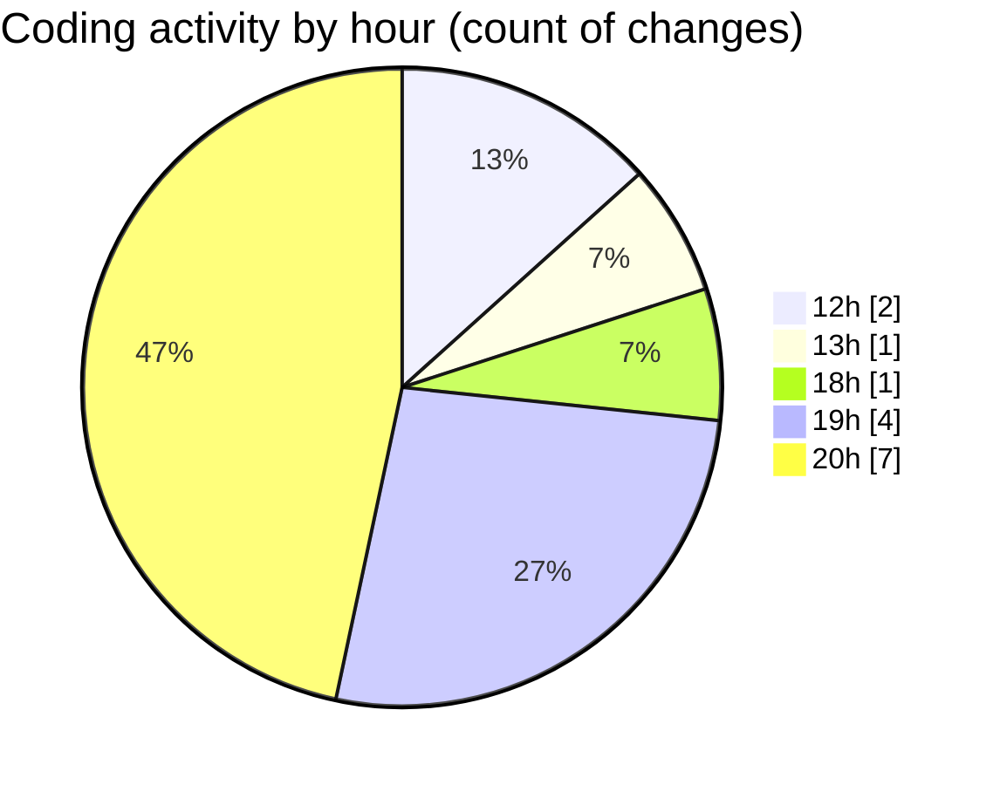

# classwork - Activity Summary 

## Overall Statistics

| Stat                   | Value                                                             |
| ---------------------- | ----------------------------------------------------------------- |
| **Lines Added** (➕)   | 146                                          |
| **Lines Removed** (➖) | 6                                        |
| **Net Change** (↕)    | 140                |
| **Active Time** (⌚)   | 14 minutes |

## Modified Files
- **Main.java** (+19, -0)
- **wow.java** (+14, -0)
- **sentinalStructure.java** (+27, -5)
- **CheckingInput.java** (+27, -0)
- **MaxMin.java** (+38, -0)
- **HopscothPractice.java** (+21, -1)

## Visualizations

### By File Type (Lines Changed)

### By Hour (Estimated Activity Count)

> **Last Updated:** 2/10/2025, 8:22:25 PM