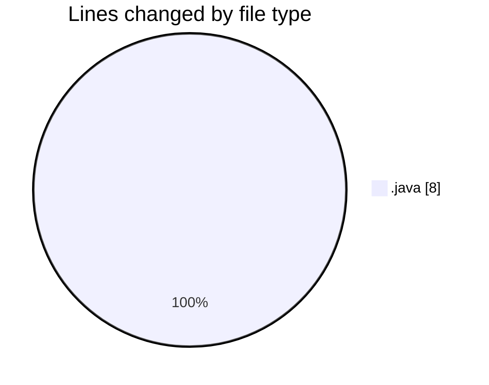
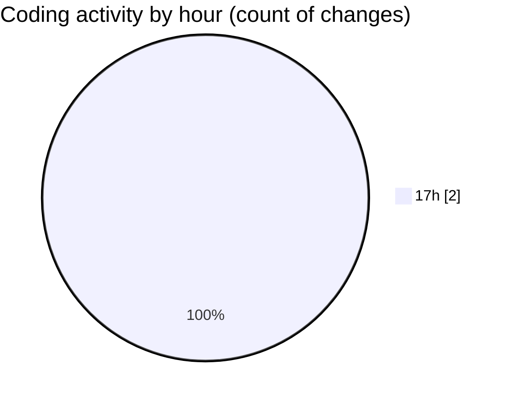

# optional codings - Activity Summary 

## Overall Statistics

| Stat                   | Value                                                             |
| ---------------------- | ----------------------------------------------------------------- |
| **Lines Added** (➕)   | 8                                          |
| **Lines Removed** (➖) | 0                                        |
| **Net Change** (↕)    | 8                |
| **Active Time** (⌚)   | 2 minutes |

## Modified Files
- **OptionalCoding1Q3.java** (+8, -0)

## Visualizations

### By File Type (Lines Changed)

### By Hour (Estimated Activity Count)

> **Last Updated:** 2/11/2025, 5:41:42 PM