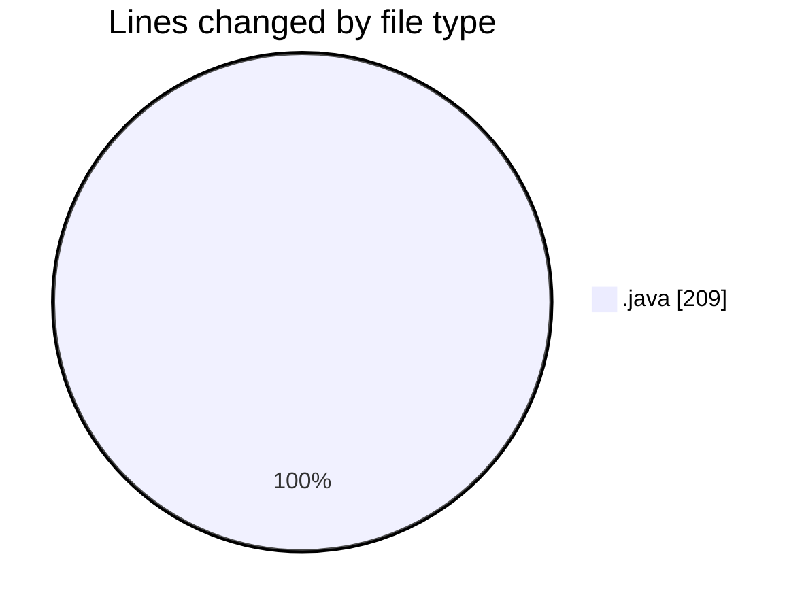
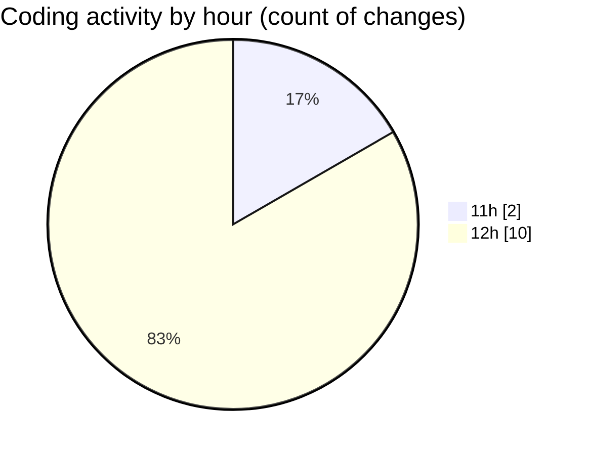

# OOPStartFiles - Activity Summary 

## Overall Statistics

| Stat                   | Value                                                             |
| ---------------------- | ----------------------------------------------------------------- |
| **Lines Added** (➕)   | 209                                          |
| **Lines Removed** (➖) | 0                                        |
| **Net Change** (↕)    | 209                |
| **Active Time** (⌚)   | 18 minutes |

## Modified Files
- **UsingCards.java** (+41, -0)
- **PlayingCards.java** (+41, -0)
- **Point.java** (+94, -0)
- **PointClient.java** (+33, -0)

## Visualizations

### By File Type (Lines Changed)

### By Hour (Estimated Activity Count)

> **Last Updated:** 2/12/2025, 12:45:42 PM