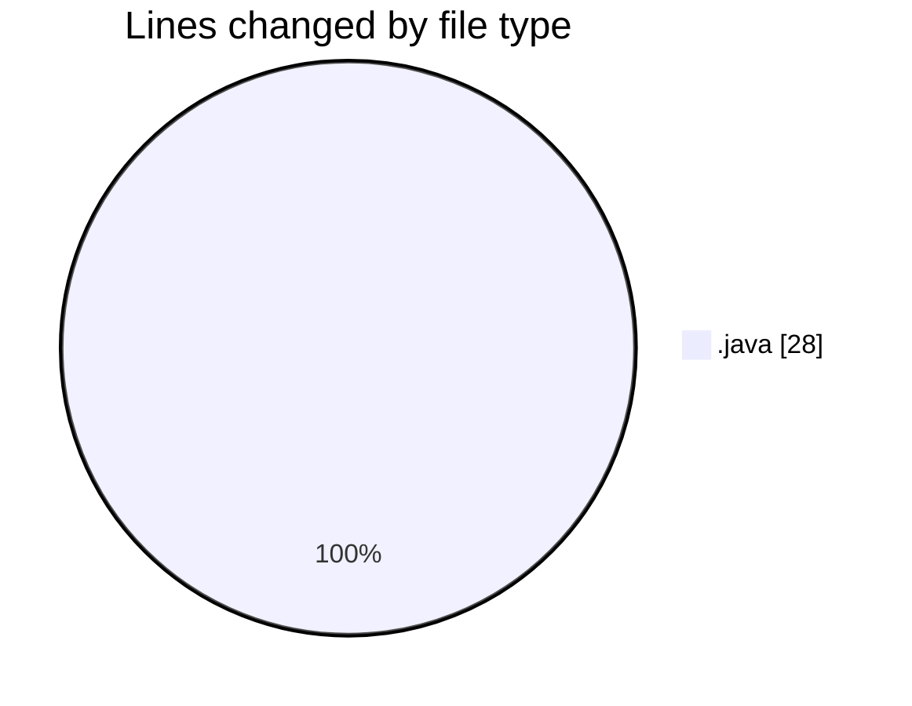
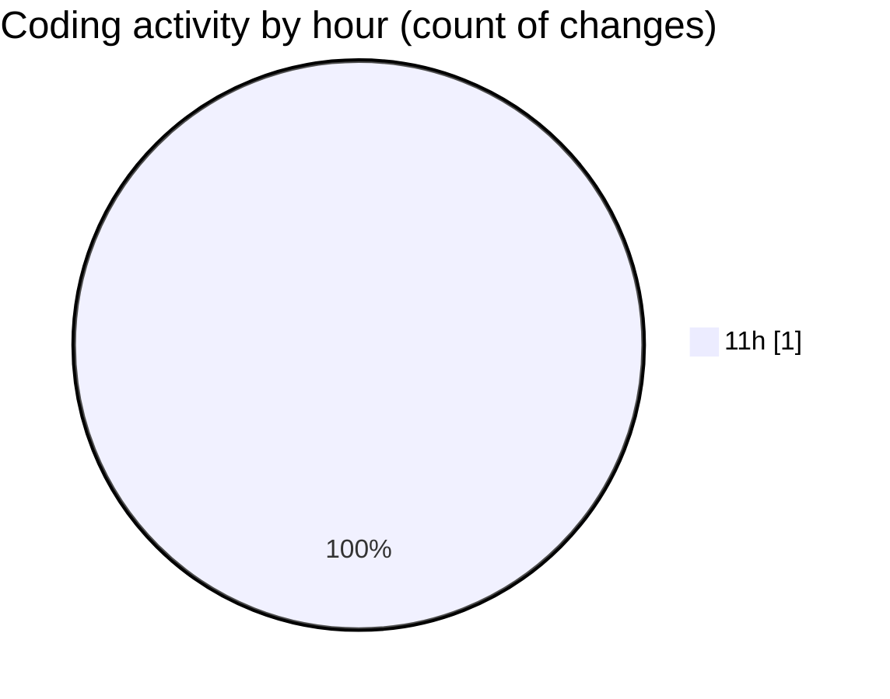

# OOPStartFiles - Activity Summary 

## Overall Statistics

| Stat                   | Value                                                             |
| ---------------------- | ----------------------------------------------------------------- |
| **Lines Added** (➕)   | 28                                          |
| **Lines Removed** (➖) | 0                                        |
| **Net Change** (↕)    | 28                |
| **Active Time** (⌚)   | 0 minute |

## Modified Files
- **UsingCards.java** (+28, -0)

## Visualizations

### By File Type (Lines Changed)

### By Hour (Estimated Activity Count)

> **Last Updated:** 2/12/2025, 11:55:42 AM