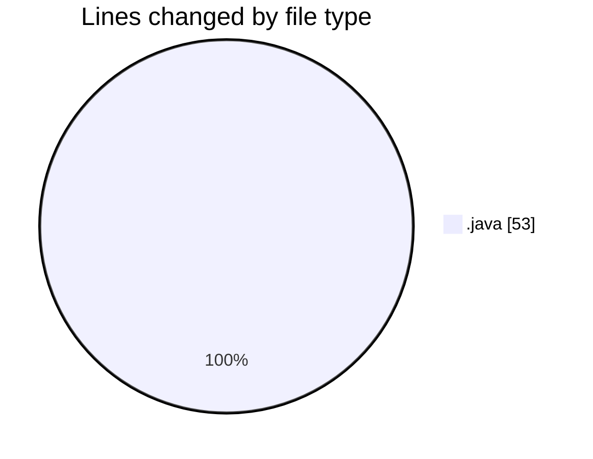
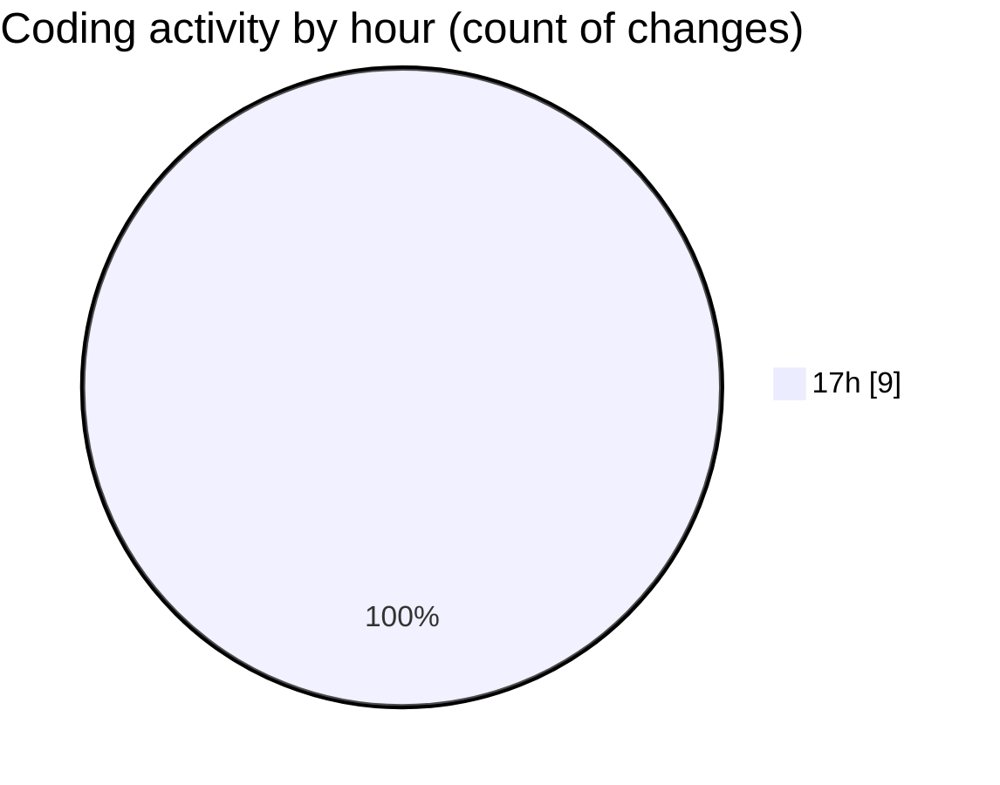

# optional codings - Activity Summary 

## Overall Statistics

| Stat                   | Value                                                             |
| ---------------------- | ----------------------------------------------------------------- |
| **Lines Added** (➕)   | 52                                          |
| **Lines Removed** (➖) | 1                                        |
| **Net Change** (↕)    | 51                |
| **Active Time** (⌚)   | 14 minutes |

## Modified Files
- **OptionalCodingLoopsQ1.java** (+16, -1)
- **OptionalCodingLoopsQ2.java** (+36, -0)

## Visualizations

### By File Type (Lines Changed)

### By Hour (Estimated Activity Count)

> **Last Updated:** 2/15/2025, 5:34:16 PM