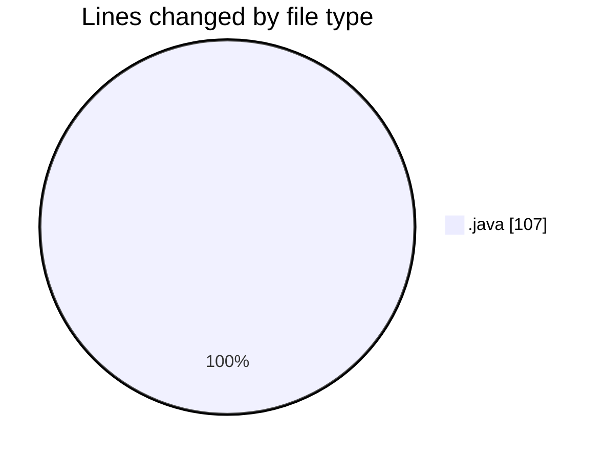
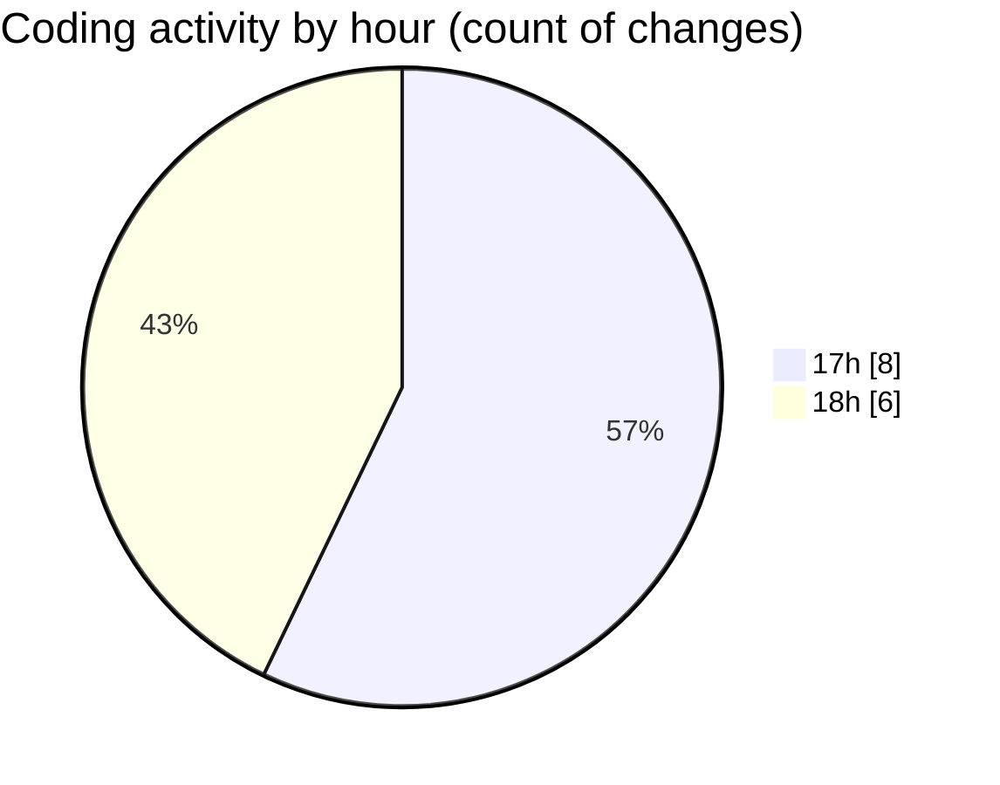

# coding prac 6 - Activity Summary 

## Overall Statistics

| Stat                   | Value                                                             |
| ---------------------- | ----------------------------------------------------------------- |
| **Lines Added** (➕)   | 103                                          |
| **Lines Removed** (➖) | 4                                        |
| **Net Change** (↕)    | 99                |
| **Active Time** (⌚)   | 25 minutes |

## Modified Files
- **CodingPrac6Q3.java** (+16, -0)
- **CodingPrac6Q4.java** (+32, -4)
- **public class CodingPrac6Q5 {.java** (+25, -0)
- **CodingPrac6Q5P2.java** (+26, -0)
- **CodingPrac6Q6.java** (+4, -0)

## Visualizations

### By File Type (Lines Changed)

### By Hour (Estimated Activity Count)

> **Last Updated:** 2/20/2025, 6:24:34 PM