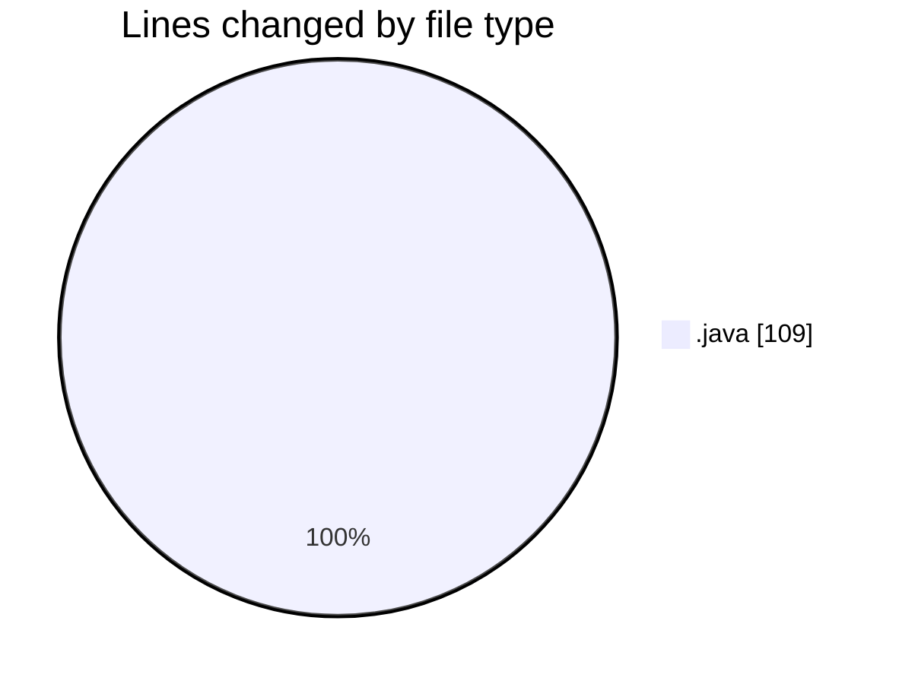
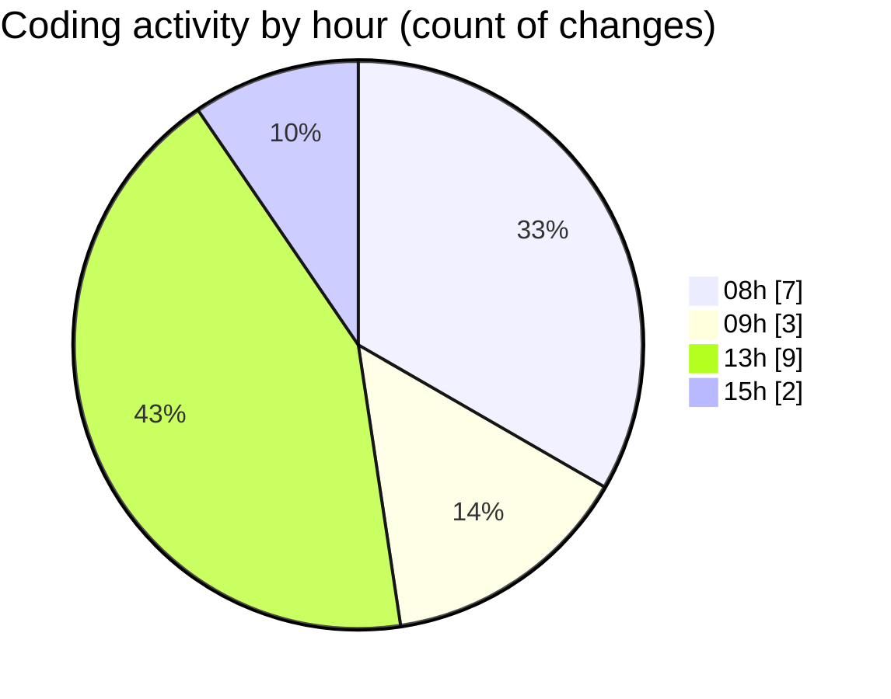

# coding prac 8 - Activity Summary 

## Overall Statistics

| Stat                   | Value                                                             |
| ---------------------- | ----------------------------------------------------------------- |
| **Lines Added** (➕)   | 106                                          |
| **Lines Removed** (➖) | 3                                        |
| **Net Change** (↕)    | 103                |
| **Active Time** (⌚)   | 28 minutes |

## Modified Files
- **CodingPrac8Q1.java** (+23, -2)
- **CodingPrac8Q2.java** (+20, -0)
- **CodingPrac8q3.java** (+21, -1)
- **CodingPrac8Q4.java** (+22, -0)
- **CodingPrac8Q5.java** (+20, -0)

## Visualizations

### By File Type (Lines Changed)

### By Hour (Estimated Activity Count)

> **Last Updated:** 2/27/2025, 3:49:59 PM