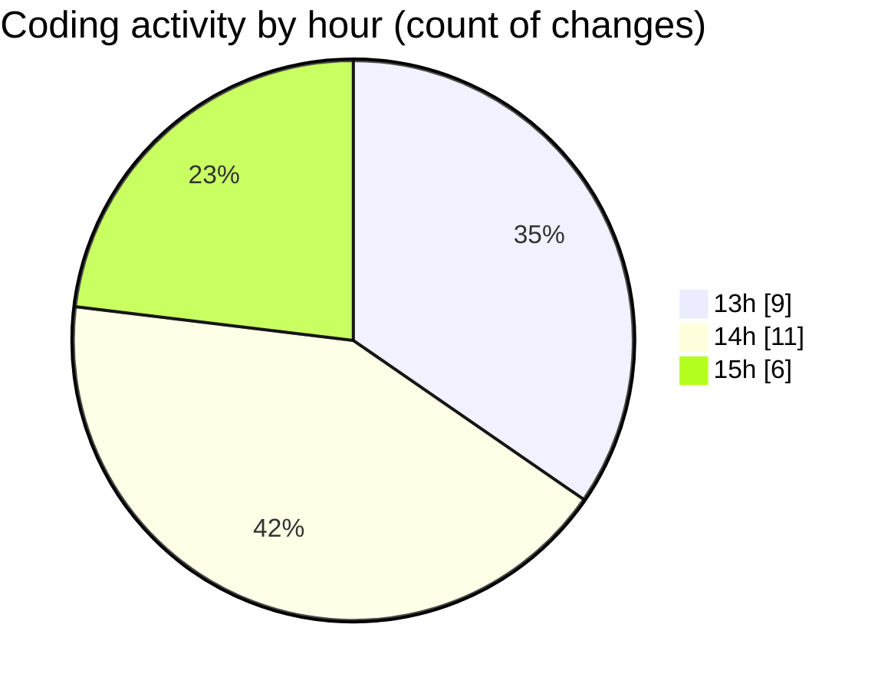

# computer 202 - Activity Summary 

## Overall Statistics

| Stat                   | Value                                                             |
| ---------------------- | ----------------------------------------------------------------- |
| **Lines Added** (➕)   | 326                                          |
| **Lines Removed** (➖) | 2                                        |
| **Net Change** (↕)    | 324                |
| **Active Time** (⌚)   | 29 minutes |

## Modified Files
- **MidterPracB2.java** (+43, -2)
- **MidtermPracB3.java** (+45, -0)
- **MidTermPracB4.java** (+39, -0)
- **RetailItem.java** (+50, -0)
- **Maintwo.java** (+33, -0)
- **RetailChecker.java** (+33, -0)
- **PracForReadingFile.java** (+32, -0)
- **PracReadingPart2.java** (+35, -0)
- **FilePrace.java** (+16, -0)

## Visualizations

### By File Type (Lines Changed)

### By Hour (Estimated Activity Count)

> **Last Updated:** 3/8/2025, 4:01:49 PM