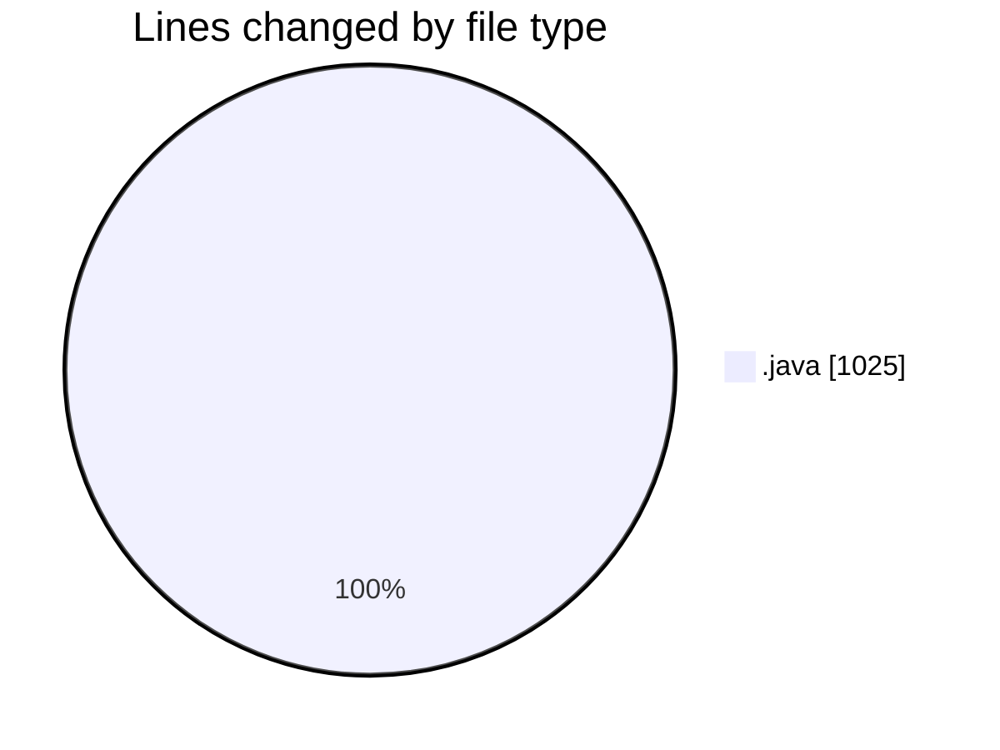
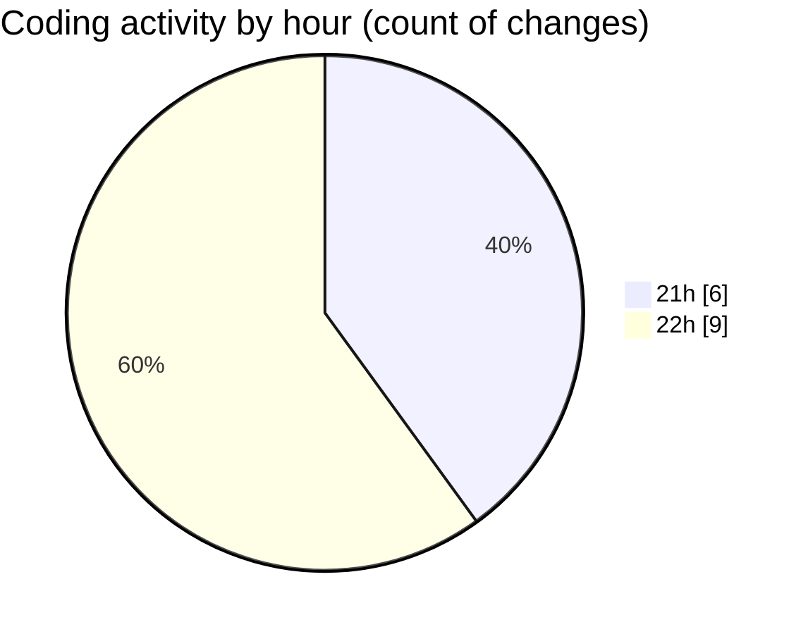

# StartFiles (2) - Activity Summary 

## Overall Statistics

| Stat                   | Value                                                             |
| ---------------------- | ----------------------------------------------------------------- |
| **Lines Added** (➕)   | 1014                                          |
| **Lines Removed** (➖) | 11                                        |
| **Net Change** (↕)    | 1003                |
| **Active Time** (⌚)   | 27 minutes |

## Modified Files
- **MultiSidedDie1.java** (+61, -0)
- **Wizard.java** (+164, -0)
- **RPGCharacter.java** (+201, -0)
- **MultiSidedDie.java** (+70, -9)
- **Fighter.java** (+152, -1)
- **BasicRPGDriver.java** (+296, -1)
- **MultiSidedDie12.java** (+70, -0)

## Visualizations

### By File Type (Lines Changed)

### By Hour (Estimated Activity Count)

> **Last Updated:** 4/2/2025, 10:45:57 PM