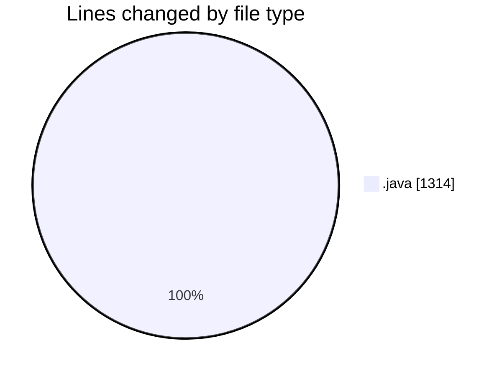
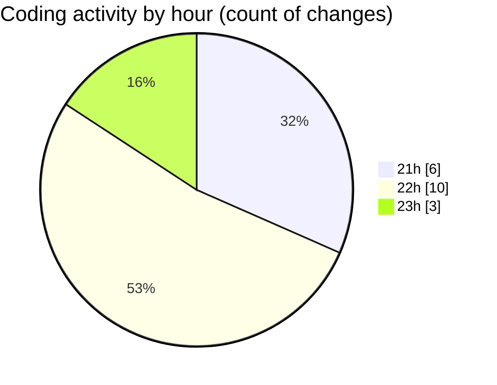

# StartFiles (2) - Activity Summary 

## Overall Statistics

| Stat                   | Value                                                             |
| ---------------------- | ----------------------------------------------------------------- |
| **Lines Added** (➕)   | 1294                                          |
| **Lines Removed** (➖) | 20                                        |
| **Net Change** (↕)    | 1274                |
| **Active Time** (⌚)   | 31 minutes |

## Modified Files
- **MultiSidedDie1.java** (+61, -0)
- **Wizard.java** (+164, -0)
- **RPGCharacter.java** (+411, -0)
- **MultiSidedDie.java** (+140, -18)
- **Fighter.java** (+152, -1)
- **BasicRPGDriver.java** (+296, -1)
- **MultiSidedDie12.java** (+70, -0)

## Visualizations

### By File Type (Lines Changed)

### By Hour (Estimated Activity Count)

> **Last Updated:** 4/2/2025, 11:05:19 PM